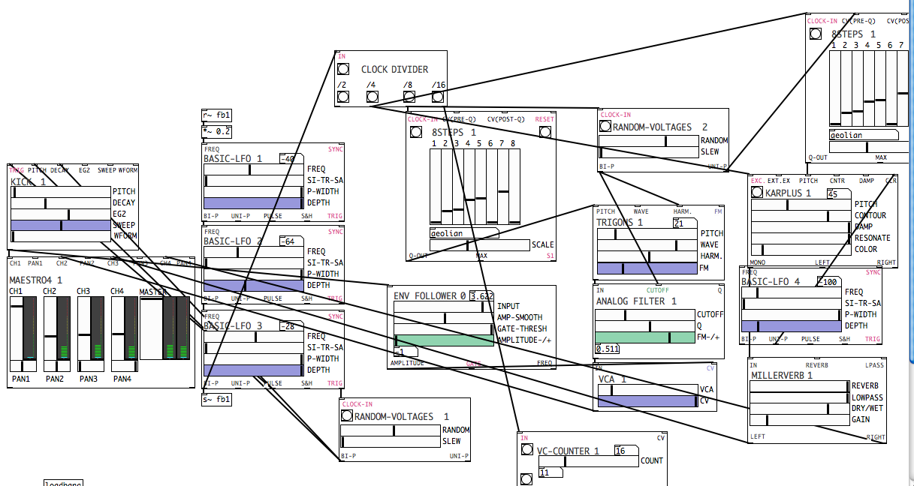

# Automatism Batisimo

> Automatism 3.1 > Batisimo 0.1

A [PD](https://puredata.info/) Vanilla Friendly modular synth.  

[_Automatonism_](https://www.automatonism.com/) is the name of both the software and the creative output of its developer, [Johan Eriksson](https://www.automatonism.com/bio/). A PhD student at Birmingham Conservatoire, UK.

_Batisimo_ is the extended fork of the instrument maintained by Bruno Herfst and tries to keep the original synth and it's community developped modules in sync. Setups are saved as branches.
